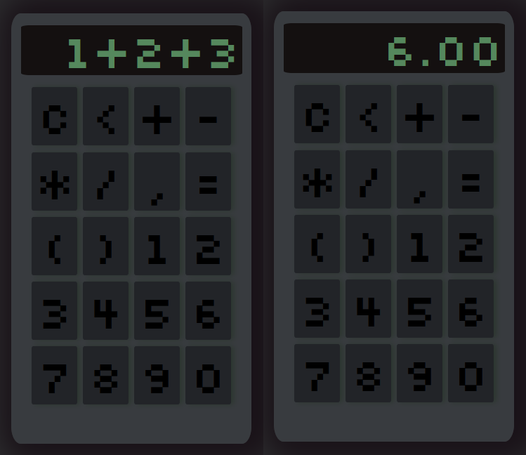

# https://bubenture.github.io/calculator

    
    

 

### Single Page Web Application

#### User Interface:
The page displays a calculator with a screen for outputting expressions and results, along with a set of buttons for entering numbers, operations, and controls (clear, delete character, calculate result).

#### Input Expression:
Users can form an expression by pressing buttons. All button presses are displayed on the calculator's screen.

#### Calculation:
When the "=" button is pressed, the entered expression is checked for correctness and calculated using a built-in JavaScript function. The result is rounded to two decimal places.

#### Error Handling:
If the expression contains invalid characters or is incorrect, an error message appears on the screen.

#### Responsiveness:
The size of the calculator automatically adjusts to fit the screen size of the device.

#### Features:
- Support for all basic arithmetic operations and parentheses.
- Validation of the expression before calculation.
- Error messages for incorrect input.
- Responsive layout for different devices.
- No server connection required — everything operates on the client side.
