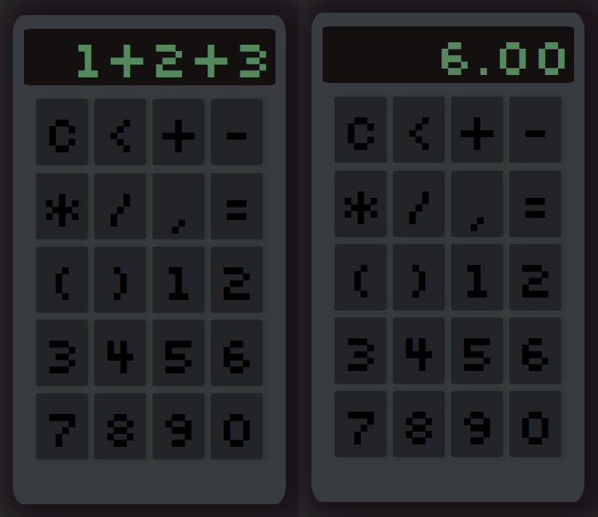

# https://bubenture.github.io/calculator

 

    
    

 

Одностраничное веб-приложение
#### Пользовательский интерфейс:
На странице отображается калькулятор с экраном для вывода выражения и результата, а также набором кнопок для ввода чисел, операций и управления (очистка, удаление символа, вычисление результата).
#### Ввод выражения:
Пользователь формирует выражение, нажимая кнопки. Все нажатия отображаются на экране калькулятора.
#### Вычисление:
При нажатии кнопки "=" введённое выражение проверяется на корректность и вычисляется с помощью встроенной функции JavaScript. Результат округляется до двух знаков после запятой.
#### Обработка ошибок:
Если в выражении есть недопустимые символы или оно некорректно, на экране появляется сообщение об ошибке.
#### Адаптивность:
Размер калькулятора автоматически подстраивается под размер экрана устройства.
#### Особенности
- Поддержка всех базовых арифметических операций и скобок.
- Проверка корректности выражения перед вычислением.
- Сообщения об ошибках при некорректном вводе.
- Адаптивная верстка для разных устройств.
- Не требует подключения к серверу — всё работает на стороне клиента.

